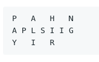
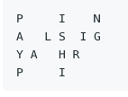

# ZigZag Conversion

The string "PAYPALISHIRING" is written in a zigzag pattern on a given number of rows like this:



Then, read the zigzag'd phrase from the top down and form a return string line by line. The return value for the above input should be "PAHNAPLSIIGYIR". 

If the input had been the same, but with four rows instead of three, our zigzag would look like this:



Then the return value would instead be "PINALSIGYAHRPI".

## Examples

```javascript
    convert("PAYPALISHIRING", 3)
        => "PAHNAPLSIIGYIR"
    convert("PAYPALISHIRING", 4)
        => "PINALSIGYAHRPI"
```

## Constraints
- Input will be a single string and an integer.

## Source
[LeetCode](https://leetcode.com/problems/zigzag-conversion/)